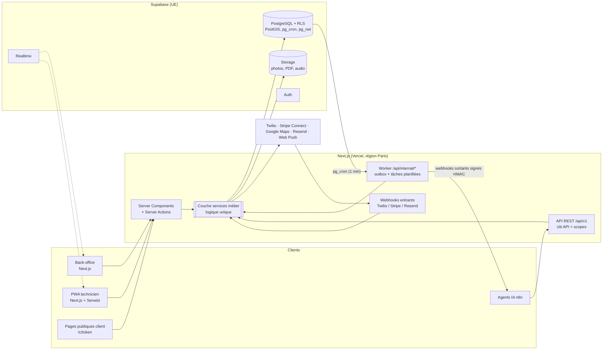
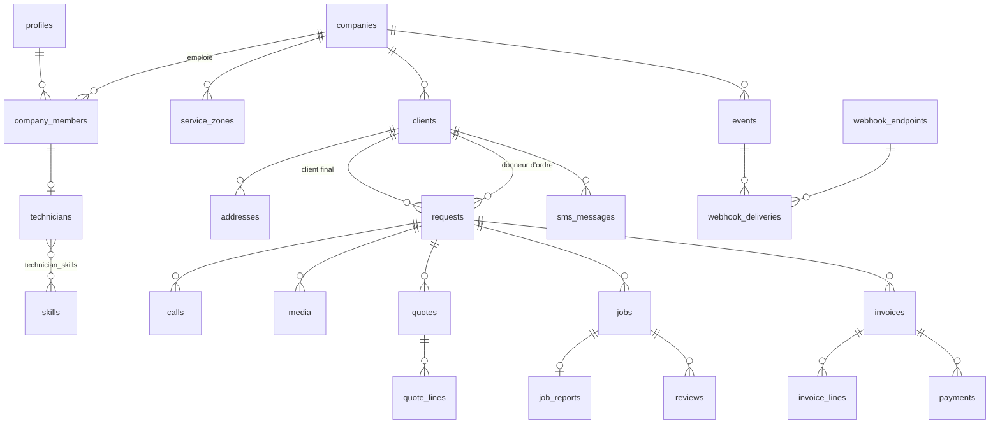
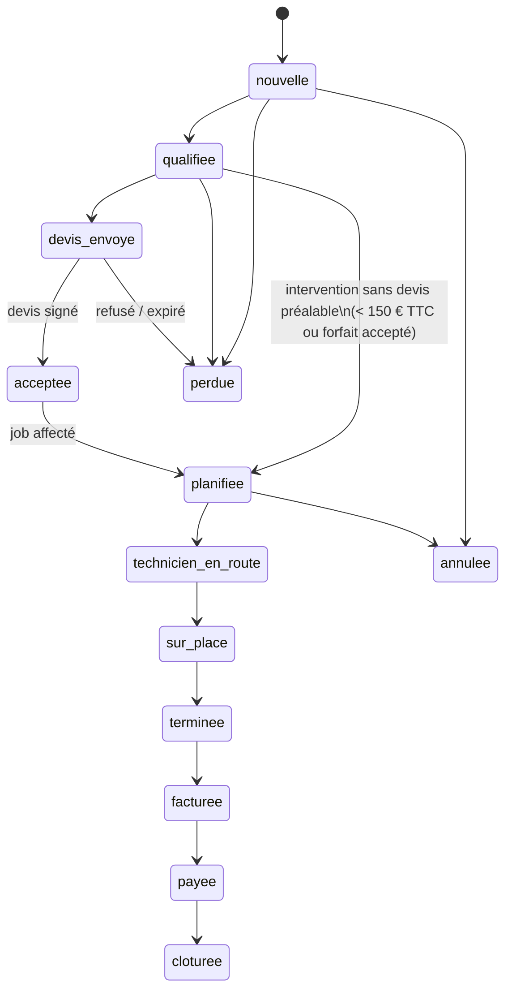

# UrgencePro — Dossier d'architecture (v0.1, à valider)

> Statut : **proposition**. Aucun code applicatif n'est écrit tant que ce document n'est pas validé.
> Les points marqués **[DÉCISION]** demandent un arbitrage (récapitulés en fin de document, §11).

---

## 1. Vue d'ensemble



### Principes structurants

| Principe | Mise en œuvre |
|---|---|
| **Une seule logique métier** | Toute mutation passe par `src/server/services/*`. Les Server Actions (UI), l'API REST (n8n) et les webhooks entrants (Twilio, Stripe) appellent les **mêmes** fonctions. Aucune règle métier dans les composants ni dans les routes. |
| **Piloté par événements** | Chaque changement significatif écrit un enregistrement dans `events` **dans la même transaction** que la donnée (pattern *transactional outbox*). Un worker distribue ensuite : webhooks sortants, SMS automatiques, notifications push, recalcul de stats. |
| **API-first** | L'API REST `/api/v1` couvre 100 % de ce que fait l'interface. Schémas zod → OpenAPI généré automatiquement → documentation `/docs/api`. |
| **Multi-tenant strict** | `company_id` sur toutes les tables métier + RLS. Le `company_id` et le rôle sont injectés dans le JWT (Custom Access Token Hook Supabase). |
| **Le client final n'a pas de compte** | Liens à jeton opaque, haché en base, expirables, à usages limités. Les pages publiques ne touchent jamais la base avec des droits anonymes : elles passent par des routes serveur qui valident le jeton puis agissent avec un périmètre restreint. |
| **L'IA propose, l'humain dispose** | Champs `ai_*` séparés des champs validés ; badge « Proposé par l'IA » ; interrupteurs d'automatisation par entreprise. |
| **Données en Europe** | Supabase région UE (Paris `eu-west-3` ou Francfort), Vercel `cdg1`, Twilio région `ie1`. |

---

## 2. Stack et bibliothèques

| Domaine | Choix | Remarque |
|---|---|---|
| Framework | Next.js 15 (App Router), TypeScript strict | Server Components par défaut, Server Actions pour les mutations UI |
| UI | Tailwind CSS, shadcn/ui, lucide-react, `next-themes` (clair/sombre) | Cibles tactiles ≥ 44 px, contraste AA |
| Formulaires | react-hook-form + zod (schémas partagés front/back/API) | |
| Tableaux | TanStack Table (pagination serveur, tri, filtres dans l'URL) | |
| Glisser-déposer | dnd-kit (kanban des demandes, planning) | Planning maison : évite la licence payante FullCalendar Resource |
| Graphiques | recharts | |
| Dates / formats | date-fns + `fr`, date-fns-tz (`Europe/Paris`), `Intl.NumberFormat('fr-FR')`, libphonenumber-js (E.164, affichage `06 12 34 56 78`) | Montants stockés en **centimes (entier)** |
| BDD / Auth / Storage / Realtime | Supabase (PostgreSQL 15, PostGIS, pg_cron, pg_net, Vault) | Types générés `supabase gen types` |
| Téléphonie / SMS | Twilio Programmable Voice + Messaging, sous-compte par entreprise **[DÉCISION 3]** | |
| Cartographie | Google Maps Platform : Places Autocomplete (New), Geocoding, **Routes API** (`computeRouteMatrix`, trafic) **[DÉCISION 2]** | Distance Matrix est l'ancienne API ; Routes la remplace |
| Paiement | Stripe Billing (abonnement SaaS) + **Stripe Connect Express** (encaissements des artisans) **[DÉCISION 4]** | |
| PDF | `@react-pdf/renderer` (côté serveur) | Devis, factures, rapports d'intervention |
| Signature | Canvas (`signature_pad`) + horodatage + empreinte SHA-256 du PDF **[DÉCISION 5]** | Yousign en option ultérieure |
| E-mails | Resend + React Email | |
| PWA | Serwist (service worker), Dexie (IndexedDB) pour la file hors connexion, Web Push (VAPID, `web-push`) | |
| Limitation de débit | Upstash Ratelimit (Redis) — repli Postgres si non souhaité | |
| Doc API | `@asteasolutions/zod-to-openapi` + Scalar sur `/docs/api` | |
| Tests | Vitest (moteur de prix, machine à états, signatures HMAC), Playwright (parcours critiques) | |
| Qualité | ESLint, Prettier, `tsc --noEmit`, CI GitHub Actions | |

---

## 3. Multi-tenant, authentification et rôles

### 3.1 Modèle

- `auth.users` (Supabase) ↔ `profiles` (1-1) : identité de la personne.
- `company_members` : lien personne ↔ entreprise avec **rôle**. Une personne peut appartenir à plusieurs entreprises (ex. un dispatcher partagé) ; l'entreprise active est choisie à la connexion.
- Rôles : `admin` (gérant, accès complet), `dispatcher` (secrétaire), `technician`. Un drapeau `is_owner` protège le propriétaire (abonnement, suppression de l'entreprise).
- Client final : **aucun compte**, accès par `public_links`.
- Machines : `api_keys` (n8n et autres intégrations), portée = une entreprise + scopes.

### 3.2 JWT et RLS

Un *Custom Access Token Hook* ajoute au JWT : `company_id`, `role`, `member_id`, `technician_id` (si technicien). Fonctions SQL utilitaires (schéma `app`, `stable`, `security definer` quand nécessaire) :

```sql
app.company_id()        -- (auth.jwt() ->> 'company_id')::uuid
app.role()              -- 'admin' | 'dispatcher' | 'technician'
app.technician_id()
app.is_staff()          -- admin ou dispatcher
app.can_see_request(request_id uuid)  -- staff, ou technicien affecté à un job de la demande
```

Gabarit de politiques appliqué à **chaque** table métier :

```sql
-- Lecture : même entreprise, non supprimé ; restriction supplémentaire pour les techniciens
create policy sel on requests for select
  using (company_id = app.company_id() and deleted_at is null
         and (app.is_staff() or app.can_see_request(id)));

-- Écriture : staff uniquement (les techniciens écrivent via des services ciblés)
create policy ins on requests for insert with check (company_id = app.company_id() and app.is_staff());
create policy upd on requests for update using (company_id = app.company_id() and app.is_staff())
                                       with check (company_id = app.company_id());
-- Pas de DELETE : suppression logique uniquement (deleted_at)
```

Règles par rôle (résumé) :

| Ressource | Admin | Dispatcher | Technicien |
|---|---|---|---|
| Paramètres, utilisateurs, abonnement, clés API, webhooks | ✅ | ❌ | ❌ |
| Grilles tarifaires, catalogue | ✅ | lecture | lecture |
| Demandes, clients, devis, planning | ✅ | ✅ | ses missions uniquement (+ client/adresse/photos liés) |
| Factures, paiements | ✅ | ✅ | créer/encaisser sur ses missions |
| Statistiques globales | ✅ | ✅ (sans marge) | ses propres stats |
| Journal d'audit | ✅ | ❌ | ❌ |

### 3.3 Trois chemins d'accès aux données

1. **Utilisateur connecté** (back-office, PWA) → client Supabase *avec la session de l'utilisateur* → RLS appliquée par Postgres.
2. **API REST (n8n)** → authentification par clé API → client *service role* **toujours** contraint par `company_id` de la clé dans la couche service (helper `scopedDb(companyId)` qui ajoute le filtre et refuse toute requête sans lui) + vérification des scopes.
3. **Pages publiques client** → validation du jeton `public_links` → service dédié avec périmètre strict (ex. « ajouter un média à la demande X »), jamais d'accès générique.

Les webhooks Twilio/Stripe/Resend suivent le chemin 2 après vérification de leur signature.

---

## 4. Modèle de données

### 4.1 Conventions

- Clé primaire `id uuid default gen_random_uuid()`.
- Colonnes communes à toutes les tables métier : `company_id uuid not null`, `created_at`, `updated_at` (trigger), `created_by uuid null`, `deleted_at timestamptz null` (suppression logique).
- **Exceptions légales** : `invoices`, `invoice_lines`, `payments` ne sont jamais supprimées ni modifiées après émission (correction par avoir). Les données personnelles sont **anonymisées** (RGPD) tout en conservant les pièces comptables 10 ans.
- Montants en **centimes** (`bigint`), taux de TVA en **points de base** (`2000`, `1000`, `550`).
- Téléphones en E.164 (`+33612345678`), géographie en `geography(Point, 4326)` (PostGIS).
- Énumérations Postgres pour les statuts (lisibles dans l'API).
- Références lisibles par entreprise et par année : `DEM-2026-00042`, `DEV-2026-0153`, `FAC-2026-000981` via `document_sequences` (verrou de ligne → numérotation **continue sans trou**, obligatoire pour les factures).
- Index : `(company_id, status)`, `(company_id, created_at desc)`, clés étrangères, `gin` sur `tags` et `jsonb` filtrés, `gist` sur les colonnes géographiques, index partiels `where deleted_at is null`.

### 4.2 Champs IA (tables `requests`, `calls`, `quotes`, `jobs`, `sms_messages`, `reviews`)

| Colonne | Type | Rôle |
|---|---|---|
| `ai_summary` | text | Résumé (appel, demande, SMS) |
| `ai_qualification` | jsonb | Proposition structurée (métier, type de problème, urgence, complexité…) |
| `ai_confidence_score` | numeric(4,3) | 0 → 1 |
| `ai_suggested_price_min_cents` / `_max_cents` | bigint | Fourchette proposée |
| `ai_suggested_technician_id` | uuid | (jobs) |
| `ai_processed_at` | timestamptz | |
| `ai_agent` | text | Nom/version de l'agent n8n (traçabilité) |
| `ai_review_status` | enum `proposed / accepted / edited / rejected` | Validation humaine |
| `ai_reviewed_by`, `ai_reviewed_at` | | |

Les valeurs IA ne remplacent **jamais** silencieusement les champs validés, sauf si l'automatisation correspondante est activée **et** que le score de confiance dépasse le seuil réglé par l'entreprise.

### 4.3 Schéma entité-relation (simplifié)



### 4.4 Tables détaillées

#### Entreprise, utilisateurs, équipe

| Table | Colonnes principales |
|---|---|
| **companies** | `name`, `legal_name`, `legal_form`, `share_capital_cents`, `siret`, `vat_number`, `naf_code`, `rcs_city`, `address` (jsonb), `phone`, `email`, `website`, `logo_path`, `brand_color`, `trades text[]`, `timezone` (défaut `Europe/Paris`), `insurance` (jsonb : assureur, n° de police, type décennale/RC pro, couverture géographique), `hourly_rate_cents`, `default_quote_validity_days`, `payment_terms`, `late_penalty_text`, `google_place_id`, `settings jsonb` (préférences), `plan`, `subscription_status`, `stripe_customer_id`, `stripe_connect_account_id`, `twilio_subaccount_sid`, `onboarding_step`, `onboarding_completed_at` |
| **profiles** | `id` (= auth.users.id), `first_name`, `last_name`, `phone`, `avatar_path` |
| **company_members** | `company_id`, `profile_id`, `role` enum, `is_owner`, `is_active`, `last_seen_at` |
| **invitations** | `email`, `role`, `token_hash`, `expires_at`, `accepted_at` |
| **technicians** | `member_id`, `display_name`, `photo_path`, `color`, `vehicle_label`, `home_base` (geography), `max_jobs_per_day`, `location_sharing_enabled`, `is_active` |
| **skills** | `trade`, `code`, `label` (catalogue global `company_id null` + ajouts entreprise) |
| **technician_skills** | `technician_id`, `skill_id`, `level` 1-3 |
| **technician_schedules** | horaires hebdomadaires récurrents : `weekday`, `start_time`, `end_time` |
| **technician_unavailabilities** | `starts_at`, `ends_at`, `kind` (congé, pause, maladie, formation), `note` |
| **on_call_shifts** | astreintes : `technician_id`, `starts_at`, `ends_at`, `priority` |
| **technician_locations** | dernière position (PK `technician_id`) : `location`, `accuracy_m`, `heading`, `speed`, `recorded_at` |
| **technician_location_history** | historique court (purge automatique à 30 jours, partitionnement mensuel) |
| **service_zones** | `name`, `kind` (`postal_codes` / `polygon` / `radius`), `postal_codes text[]`, `area geography(Polygon)`, `center`, `radius_km`, `travel_fee_cents`, `travel_fee_per_km_cents`, `is_active` |
| **business_hours** | `weekday`, `opens_at`, `closes_at` (définit jour / nuit / week-end) |
| **public_holidays** | table globale (jours fériés France + Alsace-Moselle) alimentée par le seed |
| **push_subscriptions** | `member_id`, `endpoint`, `p256dh`, `auth`, `user_agent` |
| **notifications** | `member_id`, `type`, `title`, `body`, `link`, `read_at` |

#### CRM

| Table | Colonnes principales |
|---|---|
| **clients** | `type` enum (`particulier`, `professionnel`, `syndic`, `agence_immobiliere`, `assureur`, `bailleur`), `civility`, `first_name`, `last_name`, `company_name`, `siret`, `email`, `phone`, `phone_secondary`, `tags text[]`, `notes`, `price_list_id` (tarifs spécifiques donneur d'ordre), `payment_terms_days`, `sms_opt_out_at`, `marketing_consent_at`, `gdpr_consent_at`, `anonymized_at`, `source` |
| **client_contacts** | contacts multiples pour les pros (gestionnaire de syndic, etc.) |
| **addresses** | `client_id`, `label`, `line1`, `line2`, `postal_code`, `city`, `country`, `location` (geography), `google_place_id`, `housing_type` (appartement, maison, local pro, parties communes), `floor`, `door_code`, `intercom`, `access_notes`, `service_zone_id` (calculé), `geocoded_at` |
| **equipment** | équipements suivis chez le client (chaudière, cumulus…) : `address_id`, `kind`, `brand`, `model`, `installed_on`, `last_service_on` |
| **maintenance_plans** | rappels d'entretien : `equipment_id`, `frequency_months`, `next_due_on`, `last_reminder_at`, `is_active` |

#### Demandes et qualification

| Table | Colonnes principales |
|---|---|
| **requests** | `reference`, `client_id`, `ordering_party_id` (donneur d'ordre, client pro), `address_id`, `source` (`call`, `missed_call`, `sms`, `web`, `api`, `manual`), `trade`, `problem_type_id`, `urgency` enum (`absolue`, `moins_2h`, `dans_la_journee`, `planifiee`), `description`, `complexity_score` 1-5, `estimated_duration_min`, `price_min_cents`, `price_max_cents`, `price_breakdown jsonb` (détail transparent affiché au client), `status` enum (cf. §4.5), `lost_reason`, `cancel_reason`, `out_of_zone` bool, `out_of_skills` bool, `partner_referral`, `assigned_dispatcher_id`, `first_response_at`, `qualified_at`, `closed_at`, champs `ai_*` |
| **request_status_history** | `request_id`, `from_status`, `to_status`, `reason`, `actor_type`, `actor_id`, `occurred_at` |
| **request_notes** | notes internes horodatées |
| **problem_types** | catalogue par métier (global + personnalisable) : `trade`, `code`, `label`, `default_complexity`, `default_duration_min`, `default_items jsonb` (prestations/pièces probables), `qualification_questions jsonb` |
| **partners** | confrères vers qui rediriger les demandes hors zone/compétence |

#### Téléphonie

| Table | Colonnes principales |
|---|---|
| **phone_numbers** | `e164`, `twilio_sid`, `kind` (`virtual`, `forwarded_from`), `capabilities` (voix/SMS), `is_primary`, `regulatory_bundle_sid` |
| **voice_settings** | `greeting_text` / `greeting_audio_path`, `voice`, `recording_enabled`, `recording_notice_text`, `ivr_enabled`, `ivr_menu jsonb`, `voicemail_enabled`, `ai_agent_enabled`, `ai_agent_url` |
| **call_routing_rules** | `name`, `priority`, `schedule jsonb` (jours/plages), `applies_on_holidays`, `strategy` (`simultaneous`, `sequential`), `targets jsonb` (membres, astreinte du moment, numéro externe), `ring_timeout_s`, `fallback` (`voicemail`, `ai_agent`, `forward`), `is_active` |
| **calls** | `twilio_call_sid`, `direction`, `from_e164`, `to_e164`, `status` (`ringing`, `answered`, `missed`, `voicemail`, `ai_handled`, `failed`), `started_at`, `answered_at`, `ended_at`, `duration_s`, `wait_s`, `answered_by_member_id`, `routing_rule_id`, `client_id`, `request_id`, `recording_path`, `recording_consent`, `transcript`, `missed_call_sms_sent_at`, champs `ai_*` |

#### Médias et liens publics

| Table | Colonnes principales |
|---|---|
| **media** | `request_id`, `job_id`, `kind` (`photo`, `video`, `audio`, `document`, `signature`), `category` (`client_upload`, `before`, `after`, `report`, `quote_signature`, `report_signature`), `storage_path`, `thumb_path`, `mime_type`, `size_bytes`, `width`, `height`, `duration_s`, `uploaded_by_type` (`member`, `client`, `api`), `uploaded_by_id`, `taken_at`, `location` |
| **public_links** | `token_hash` (SHA-256, le jeton clair n'est jamais stocké), `purpose` (`upload_media`, `tracking`, `quote`, `payment`, `review`), `request_id`, `quote_id`, `invoice_id`, `job_id`, `expires_at`, `max_uses`, `use_count`, `last_used_at`, `revoked_at` |
| **location_submissions** | positions/adresses envoyées par le client : `request_id`, `method` (`gps`, `autocomplete`), `location`, `accuracy_m`, `raw_address`, `extra jsonb` (code, étage, interphone, commentaire), `gdpr_consent_at` |

#### Catalogue, tarifs et devis

| Table | Colonnes principales |
|---|---|
| **catalog_items** | `kind` (`service`, `labor`, `part`, `travel`, `other`), `reference`, `label`, `description`, `unit` (u, h, m, forfait), `unit_price_ht_cents`, `cost_price_cents`, `vat_rate_bp`, `trade`, `is_active` |
| **problem_type_items** | lien type de problème ↔ éléments probables avec `quantity`, `probability` |
| **surcharge_rules** | `name`, `trigger` (`night`, `weekend`, `holiday`, `urgency_absolue`), `applies_to` (`labor`, `travel`, `all`), `mode` (`percent`, `fixed`), `value`, `time_window jsonb`, `priority`, `is_cumulative`, `is_active` |
| **price_lists** / **price_list_items** | grilles spécifiques donneurs d'ordre (prix ou remise sur un élément de catalogue) |
| **quotes** | `reference`, `request_id`, `client_id`, `billed_party_id`, `version`, `parent_quote_id`, `status` enum (`draft`, `sent`, `viewed`, `signed`, `refused`, `expired`, `cancelled`), `issued_at`, `valid_until`, `total_ht_cents`, `total_vat_cents`, `total_ttc_cents`, `deposit_cents`, `payment_terms`, `company_snapshot jsonb`, `client_snapshot jsonb`, `legal_mentions jsonb`, `reduced_vat_certified` (bool + horodatage), `immediate_execution_requested` (renonciation au délai de rétractation, §9), `sent_at`, `viewed_at`, `signed_at`, `signed_ip`, `signed_user_agent`, `signer_name`, `signature_media_id`, `pdf_path`, `signed_pdf_path`, `document_sha256`, `refusal_reason`, champs `ai_*` |
| **quote_lines** | `position`, `catalog_item_id`, `kind`, `label`, `description`, `quantity numeric(10,3)`, `unit`, `unit_price_ht_cents`, `discount_bp`, `vat_rate_bp`, `total_ht_cents`, `is_surcharge`, `is_optional` |
| **document_sequences** | `company_id`, `doc_type`, `year`, `last_value` |

#### Interventions

| Table | Colonnes principales |
|---|---|
| **jobs** | `reference`, `request_id`, `quote_id`, `technician_id`, `status` enum (`to_schedule`, `offered`, `accepted`, `en_route`, `on_site`, `completed`, `cancelled`), `scheduled_start`, `scheduled_end`, `arrival_window_min`, `eta_at`, `eta_updated_at`, `travel_distance_m`, `offered_at`, `accepted_at`, `en_route_at`, `arrived_at`, `completed_at`, `actual_duration_min`, `assignment_scoring jsonb` (explication de la suggestion), `delay_notified_at`, champs `ai_*` |
| **job_offers** | historique Accepter/Refuser : `job_id`, `technician_id`, `offered_at`, `responded_at`, `response`, `reason` |
| **job_reports** | `job_id`, `work_done`, `observations`, `recommendations`, `actual_duration_min`, `client_present`, `client_signer_name`, `client_signature_media_id`, `signed_at`, `internal_rating` 1-5, `pdf_path` |
| **job_report_items** | pièces/prestations utilisées → génèrent les mouvements de stock et pré-remplissent la facture |

#### Facturation et paiements

| Table | Colonnes principales |
|---|---|
| **invoices** | `reference` (séquence continue), `type` (`invoice`, `deposit`, `credit_note`), `request_id`, `job_id`, `quote_id`, `client_id`, `billed_party_id`, `credited_invoice_id`, `status` (`draft`, `issued`, `partially_paid`, `paid`, `overdue`, `cancelled`), `issued_at`, `service_date`, `due_date`, totaux HT/TVA/TTC, `amount_paid_cents`, snapshots entreprise/client, `legal_mentions jsonb`, `pdf_path`, `locked_at` (immuable après émission), `einvoice_status` (préparation facturation électronique, §9) |
| **invoice_lines** | identique à `quote_lines` |
| **payments** | `invoice_id`, `method` (`stripe_card`, `stripe_link`, `cash`, `check`, `card_terminal`, `transfer`), `amount_cents`, `status`, `received_at`, `received_by`, `reference`, `stripe_payment_intent_id`, `stripe_checkout_session_id`, `refunded_cents` |

#### Communication et automatisations

| Table | Colonnes principales |
|---|---|
| **sms_templates** | `key` (`missed_call`, `photo_request`, `photo_reminder`, `confirmation`, `en_route`, `delay`, `quote_sent`, `quote_reminder`, `invoice_sent`, `invoice_reminder`, `review_request`, `maintenance_reminder`, `out_of_zone`), `body` (variables `{prenom_client}`, `{entreprise}`, `{technicien}`, `{eta}`, `{lien_suivi}`, `{lien}`, `{montant}`…), `is_active` |
| **sms_messages** | `direction`, `client_id`, `request_id`, `from_e164`, `to_e164`, `body`, `template_key`, `status` (`queued`, `sent`, `delivered`, `undelivered`, `failed`, `received`), `twilio_sid`, `segments`, `price_cents`, `error_code`, `sent_by_type` (`member`, `automation`, `api`), `sent_by_id`, champs `ai_*` (intention détectée sur SMS entrants) |
| **email_messages** | journal Resend (`resend_id`, `to`, `subject`, `template_key`, `status`) |
| **sms_opt_outs** | `phone_e164`, `opted_out_at`, `source` (mot-clé STOP, manuel) — vérifié avant **tout** envoi |
| **automation_settings** | `key` (ex. `auto_send_quote`, `auto_apply_ai_qualification`, `auto_assign_technician`, `missed_call_sms`, `photo_reminder`, `quote_reminders`, `invoice_reminders`, `review_request`, `maintenance_reminders`), `enabled`, `config jsonb` (délais J+1/J+3/J+7, seuil de confiance IA…) |
| **scheduled_actions** | file des actions différées : `action` (`send_sms`, `expire_quote`, `mark_overdue`…), `run_at`, `payload`, `status`, `attempts`, `dedupe_key`, `cancel_if jsonb` (ex. annuler la relance si le devis est signé) |

#### Avis et stock

| Table | Colonnes principales |
|---|---|
| **reviews** | `source` (`internal`, `google`), `job_id`, `client_id`, `technician_id`, `rating`, `comment`, `is_private`, `google_review_id`, `author_name`, `published_at`, `reply`, `replied_at`, champs `ai_*` (sentiment, réponse suggérée) |
| **stock_locations** | `kind` (`warehouse`, `vehicle`), `technician_id` |
| **inventory_items** | `catalog_item_id`, `sku`, `label`, `unit`, `min_quantity` |
| **stock_levels** | `item_id`, `location_id`, `quantity` |
| **stock_movements** | `item_id`, `from_location_id`, `to_location_id`, `quantity`, `reason` (`purchase`, `transfer`, `job_usage`, `adjustment`), `job_id` |

#### Intégration, événements, audit

| Table | Colonnes principales |
|---|---|
| **api_keys** | `name`, `prefix` (affiché, ex. `up_live_3f9a…`), `key_hash`, `scopes text[]`, `rate_limit_per_min`, `last_used_at`, `last_used_ip`, `expires_at`, `revoked_at` |
| **idempotency_keys** | `api_key_id`, `key`, `request_hash`, `response jsonb`, `expires_at` (24 h) |
| **events** | `type` (ex. `quote.signed`), `entity_type`, `entity_id`, `payload jsonb`, `actor_type` (`member`, `api_key`, `client`, `system`, `twilio`, `stripe`), `actor_id`, `occurred_at`, `dispatched_at` |
| **webhook_endpoints** | `url`, `description`, `event_types text[]` (ou `*`), `secret` (chiffré via Supabase Vault), `is_active`, `consecutive_failures`, `disabled_at` |
| **webhook_deliveries** (= webhook_logs) | `endpoint_id`, `event_id`, `attempt`, `status` (`pending`, `success`, `failed`), `request_headers`, `response_status`, `response_body` (tronqué 4 Ko), `duration_ms`, `next_retry_at`, `delivered_at` |
| **audit_logs** | `actor_type`, `actor_id`, `action` (`insert`/`update`/`delete`/`login`/`export`…), `table_name`, `record_id`, `changes jsonb` (diff), `ip`, `user_agent`, `occurred_at` — alimenté par trigger générique + actions sensibles applicatives |
| **gdpr_requests** | demandes d'export / effacement d'un client, statut, fichier d'export |

### 4.5 Cycle de vie d'une demande



- Transitions autorisées codées dans une **machine à états** TypeScript (`src/server/domain/request-status.ts`), testée unitairement, utilisée par l'UI et l'API. Toute transition interdite renvoie une erreur 409 explicite.
- `annulee` / `perdue` exigent un motif (liste paramétrable + texte libre).
- Les statuts `technicien_en_route`, `sur_place`, `terminee` sont **dérivés** des changements de statut du job (bouton dans la PWA) ; `facturee` / `payee` sont dérivés des factures et paiements.
- Chaque transition → `request_status_history` + événement `request.status_changed` (+ événement spécifique : `technician.en_route`, `job.completed`, etc.).

---

## 5. Flux événementiel et intégration n8n

### 5.1 Outbox et worker

1. Le service métier écrit la donnée **et** la ligne `events` dans la même transaction.
2. `pg_cron` appelle toutes les minutes (via `pg_net`) la route interne `POST /api/internal/dispatch` (protégée par un secret partagé). Les actions temps réel (SMS « en route », push) sont aussi déclenchées immédiatement après la transaction ; le cron sert de filet de sécurité.
3. Le worker lit les événements non distribués (`for update skip locked`), puis :
   - crée les `webhook_deliveries` pour chaque endpoint abonné et les envoie ;
   - exécute les automatisations internes (SMS, push, e-mails) si l'interrupteur est actif ;
   - planifie les `scheduled_actions` (relances).
4. Une seconde passe traite les `scheduled_actions` arrivées à échéance (relances devis J+1/J+3/J+7, facture en retard, photos non reçues après X min, expiration des devis, rappels d'entretien).

Tout est **idempotent** (`dedupe_key`), donc un double déclenchement n'envoie jamais deux SMS.

### 5.2 Webhooks sortants

- Configuration dans *Paramètres → Intégrations → Webhooks* : URL, événements cochés, secret généré, bouton « Envoyer un test », historique, **rejeu** manuel.
- Enveloppe :

```json
{
  "id": "evt_01J9…",
  "type": "quote.signed",
  "api_version": "2026-10-01",
  "created_at": "2026-10-05T21:14:03+02:00",
  "company_id": "…",
  "data": { "object": { /* représentation API complète de la ressource */ } },
  "previous_attributes": { "status": "sent" }
}
```

- En-têtes : `X-UrgencePro-Event`, `X-UrgencePro-Delivery`, `X-UrgencePro-Signature: t=1728155643,v1=<HMAC-SHA256(secret, t + "." + body)>` (protection contre le rejeu : tolérance 5 min).
- Nouvelle tentative avec délai exponentiel : 1 min, 5 min, 30 min, 2 h, 6 h, 24 h ; désactivation automatique de l'endpoint après 20 échecs consécutifs + alerte à l'admin.
- Événements : `call.received`, `call.missed`, `call.ended`, `request.created`, `request.qualified`, `request.status_changed`, `media.uploaded`, `location.received`, `quote.created`, `quote.sent`, `quote.viewed`, `quote.signed`, `quote.expired`, `job.scheduled`, `job.assigned`, `technician.en_route`, `technician.arrived`, `job.completed`, `invoice.created`, `invoice.paid`, `invoice.overdue`, `sms.received`, `review.received` — plus `quote.refused`, `job.offer_refused`, `job.delayed`, `payment.received`, `client.created` proposés en complément.

### 5.3 API REST `/api/v1`

- Authentification : `Authorization: Bearer up_live_xxx`. Clé affichée **une seule fois** à la création, stockée hachée.
- Scopes : `requests:read|write`, `clients:read|write`, `calls:read|write`, `quotes:read|write`, `jobs:read|write`, `invoices:read|write`, `technicians:read`, `sms:send`, `media:read|write`, `stats:read`, `ai:write`, `webhooks:manage`.
- Limitation de débit par clé (défaut 120 req/min) avec en-têtes `RateLimit-*` ; 429 + `Retry-After`.
- `Idempotency-Key` accepté sur tous les POST.
- Pagination par curseur (`?limit=50&cursor=…`), filtres (`?status=qualifiee&created_after=…`), `?expand=client,address`.
- Erreurs normalisées : `{ "error": { "code": "invalid_transition", "message": "…", "details": … } }`.
- Ressources CRUD : `requests`, `clients`, `addresses`, `calls`, `media`, `quotes` (+ `lines`), `jobs`, `technicians`, `invoices`, `payments`, `sms`, `schedule` (créneaux libres), `stats`.
- **Actions dédiées aux agents IA (= webhooks entrants)** :

| Endpoint | Usage n8n |
|---|---|
| `POST /v1/requests/{id}/ai-qualification` | Pré-remplir métier, type de problème, urgence, complexité, durée, résumé, prix suggéré, confiance |
| `POST /v1/calls/{id}/ai-summary` | Transcription, résumé, intention, demande associée |
| `POST /v1/requests/{id}/suggested-technician` | Technicien suggéré + justification |
| `POST /v1/quotes` (`status: draft`) | Devis brouillon (lignes du catalogue ou libres) |
| `POST /v1/quotes/{id}/send` | Envoi (refusé si l'automatisation « envoi auto » est désactivée → reste en attente de validation) |
| `POST /v1/sms` | Envoi d'un SMS (modèle ou texte libre, opposition STOP vérifiée) |
| `POST /v1/requests/{id}/status` | Transition de statut (machine à états appliquée) |
| `POST /v1/requests/{id}/photo-request` | Génère le lien sécurisé et envoie le SMS de demande de photos |
| `GET /v1/pricing/estimate` | Calcul de fourchette par le moteur de prix (l'agent n'invente pas les prix) |
| `GET /v1/schedule/availability` | Créneaux et techniciens disponibles avec ETA |

- Documentation : `/api/v1/openapi.json` (généré depuis zod) et `/docs/api` (Scalar), avec exemples n8n (nœud *HTTP Request* + nœud *Webhook* et vérification HMAC).

---

## 6. Moteurs métier clés

### 6.1 Moteur de prix (`src/server/pricing/`) — fonction pure, testée

Entrées : type de problème, complexité, urgence, date/heure prévue, adresse (→ zone ou distance), grille du donneur d'ordre éventuel.
Calcul :
1. Éléments probables du type de problème × prix catalogue (ou grille spécifique).
2. Frais de déplacement : forfait de zone **ou** km × tarif (distance via Routes API, mise en cache).
3. Majorations applicables (nuit / week-end / férié / urgence absolue), avec règle de cumul.
4. Fourchette : bas = scénario le plus probable, haut = pièces optionnelles + durée × (1 + facteur de complexité).
Sortie : `{ min, max, breakdown[] }`. Le `breakdown` est affiché tel quel au client (**transparence anti-arnaque**).

### 6.2 Suggestion de technicien

Filtres éliminatoires : compétence requise, disponible (horaires, indisponibilités, astreinte), dans la zone.
Score pondéré (poids réglables) : ETA réel avec trafic (Routes API, matrice depuis la dernière position connue ou la mission en cours), charge du jour, niveau de compétence, note client moyenne. L'explication est stockée dans `jobs.assignment_scoring` et affichée (« 12 min, 2 missions aujourd'hui, compétence serrure multipoints »).

### 6.3 Routage téléphonique

`POST /api/twilio/voice` → identification de l'appelant (client connu ?) → création `calls` + `requests` (statut `nouvelle`) → règle de routage active (horaire, férié, astreinte) → TwiML : accueil (+ mention d'enregistrement), SVI optionnel, `<Dial>` simultané ou en cascade → sur non-réponse : messagerie avec transcription **ou** `<Connect><Stream>` / redirection vers l'agent vocal IA (URL n8n) → événement `call.missed` → SMS automatique avec lien d'envoi de photos. Le dispatcher voit l'appel entrant en temps réel (Realtime) avec la fiche du client s'il est connu.

---

## 7. Arborescence du projet

```
urgencepro/
├─ supabase/
│  ├─ migrations/              # SQL versionné (schéma, RLS, fonctions, triggers, cron)
│  ├─ seed/                    # données de référence (métiers, types de problèmes, fériés)
│  └─ config.toml
├─ scripts/
│  └─ seed-demo.ts             # 2 entreprises de démo, 6 mois d'historique (faker fr)
├─ src/
│  ├─ app/                     # routes (cf. §8)
│  ├─ components/
│  │  ├─ ui/                   # shadcn/ui
│  │  └─ shared/               # AiBadge, StatusBadge, MoneyInput, PhoneInput, AddressAutocomplete, MapView…
│  ├─ features/                # un dossier par domaine : components, actions.ts, queries.ts, schemas.ts
│  │  ├─ requests/  clients/  calls/  quotes/  jobs/  invoices/  planning/
│  │  ├─ dashboard/  technicians/  catalog/  reviews/  settings/  onboarding/
│  ├─ server/
│  │  ├─ services/             # LOGIQUE MÉTIER UNIQUE (UI + API + webhooks)
│  │  ├─ domain/               # machines à états, règles, types métier
│  │  ├─ pricing/              # moteur de prix (pur)
│  │  ├─ scheduling/           # suggestion de technicien, ETA
│  │  ├─ events/               # emit(), dispatcher, webhooks sortants, automatisations
│  │  ├─ integrations/         # twilio/, stripe/, maps/, resend/, push/
│  │  ├─ pdf/                  # gabarits react-pdf (devis, facture, rapport)
│  │  ├─ auth/                 # session, clés API + scopes, liens publics, rate limit
│  │  ├─ api/                  # helpers REST : handler(), pagination, erreurs, openapi registry
│  │  └─ db/                   # clients Supabase (user / service scopé), types générés
│  ├─ lib/                     # formatage FR (dates, €, téléphone), utilitaires
│  └─ pwa/                     # service worker Serwist, file hors connexion (Dexie), sync
├─ tests/  (unit/, e2e/)
├─ docs/   (ARCHITECTURE.md, n8n/ exemples de workflows)
└─ .env.example
```

---

## 8. Arborescence des pages

URL en français côté utilisateurs, en anglais côté API (convention attendue par les intégrateurs n8n).

### 8.1 Public / authentification

| Route | Page |
|---|---|
| `/` | Page d'accueil commerciale (minimale en v1) |
| `/connexion`, `/inscription`, `/mot-de-passe-oublie`, `/invitation/[token]` | Auth Supabase (e-mail + mot de passe, lien magique) |
| `/onboarding/[etape]` | Onboarding guidé < 10 min : 1 entreprise & mentions légales · 2 métier(s) → catalogue et tarifs pré-remplis · 3 zone d'intervention · 4 horaires & majorations · 5 numéro de téléphone (nouveau numéro ou renvoi) · 6 inviter l'équipe · 7 récapitulatif & test (appel / SMS de test) |

### 8.2 Back-office `(app)` — admin & dispatcher

| Route | Page |
|---|---|
| `/tableau-de-bord` | KPI temps réel, entonnoir, comparaison période précédente |
| `/demandes` | Liste (filtres, recherche) — `?vue=kanban` pour le kanban par statut |
| `/demandes/nouvelle` | Création rapide (pendant un appel) |
| `/demandes/[id]` | Fiche demande : client & historique, qualification (+ badge IA), photos, mini-carte, fourchette de prix détaillée, devis, interventions, SMS/appels (fil unique), notes, chronologie |
| `/appels`, `/appels/[id]` | Journal des appels, lecteur audio, transcription, résumé |
| `/planning` | Vue jour (colonnes techniciens) / semaine, glisser-déposer, bandeau « à planifier » |
| `/carte` | Carte en direct : techniciens, missions du jour, demandes en attente |
| `/clients`, `/clients/[id]` | CRM : fiche, adresses, équipements, historique, devis, factures, échanges, photos, tags, RGPD (export / anonymisation) |
| `/donneurs-ordre` | Syndics, agences, assureurs : grilles tarifaires et conditions |
| `/devis`, `/devis/[id]` | Liste + éditeur de devis (lignes, TVA, acompte, aperçu PDF, envoi SMS/e-mail) |
| `/factures`, `/factures/[id]` | Factures & avoirs, paiements, relances, exports CSV / FEC |
| `/techniciens`, `/techniciens/[id]` | Équipe, compétences, horaires, astreintes, indisponibilités, stock véhicule, performances |
| `/catalogue` | Prestations, pièces, types de problèmes, majorations |
| `/stock` | Niveaux par dépôt / véhicule, mouvements, alertes |
| `/statistiques` | Analyses détaillées (par technicien, type, zone/heatmap, créneau), exports |
| `/avis` | Avis internes et Google, réponses |
| `/notifications` | Centre de notifications |
| `/journal` | Journal d'audit (admin) |
| `/parametres/entreprise` | Infos légales, logo, couleurs, assurance, mentions |
| `/parametres/telephonie` | Numéros, accueil, SVI, règles de routage, messagerie, agent IA |
| `/parametres/sms` | Modèles SMS & e-mails, expéditeur, liste d'opposition |
| `/parametres/tarifs` | Taux horaire, déplacement, majorations, validité des devis, conditions de paiement |
| `/parametres/zones` | Dessin sur carte ou codes postaux |
| `/parametres/horaires` | Heures ouvrées, jours fériés |
| `/parametres/automatisations` | Interrupteurs et délais de chaque automatisation, seuils IA |
| `/parametres/integrations` | Clés API, webhooks (+ `/webhooks/[id]` historique & rejeu), lien doc API |
| `/parametres/utilisateurs` | Membres, rôles, invitations |
| `/parametres/paiements` | Connexion Stripe (encaissement des clients) |
| `/parametres/abonnement` | Abonnement UrgencePro (Stripe Billing, portail client) |
| `/parametres/rgpd` | Durées de conservation, registre, demandes |

### 8.3 PWA technicien `/t`

| Route | Page |
|---|---|
| `/t` | Mes missions du jour (+ demain), bouton astreinte, partage de position |
| `/t/missions/[id]` | Détail : client, adresse, accès, photos, devis ; boutons **Accepter / Refuser**, **En route → Sur place → Terminé**, navigation Google Maps / Waze |
| `/t/missions/[id]/devis` | Modification du devis sur place |
| `/t/missions/[id]/rapport` | Photos avant/après, travaux, pièces (depuis le stock véhicule), durée, observations |
| `/t/missions/[id]/signature` | Signature client à l'écran (devis ou rapport) |
| `/t/missions/[id]/encaissement` | Lien/QR Stripe, ou espèces / chèque / TPE |
| `/t/profil` | Disponibilités, notifications, stock véhicule |

Hors connexion : missions et données liées mises en cache ; actions (statuts, rapport, photos, signature, encaissement manuel) placées dans une file IndexedDB et rejouées à la reconnexion, avec horodatage d'origine et idempotence.

### 8.4 Pages publiques client `/c/[token]`

| Route | Page |
|---|---|
| `/c/[token]` | Routeur selon l'objet du lien |
| `/c/[token]/photos` | Photos/vidéo (≤ 10, compression côté navigateur), GPS en un clic ou adresse autocomplétée, code/étage/interphone/commentaire, consentement RGPD |
| `/c/[token]/suivi` | Suivi « type Uber » : carte, ETA mis à jour, nom et photo du technicien, prix annoncé |
| `/c/[token]/devis` | Consultation, détail des prix et majorations, case « intervention urgente demandée », signature, acompte |
| `/c/[token]/paiement` | Facture + Stripe Checkout (compte Connect de l'artisan) |
| `/c/[token]/avis` | Note et commentaire (cf. §9 sur la conformité) |

Toutes ces pages : sans cookie de session, `noindex`, limite de débit par IP + jeton, aucune donnée au-delà du strict nécessaire.

### 8.5 Routes techniques

| Route | Rôle |
|---|---|
| `/api/v1/**`, `/api/v1/openapi.json`, `/docs/api` | API REST + documentation |
| `/api/twilio/voice`, `/voice/status`, `/voice/recording`, `/voice/transcription`, `/sms/inbound`, `/sms/status` | Webhooks Twilio (signature `X-Twilio-Signature` vérifiée) |
| `/api/stripe/webhook`, `/api/stripe/connect/webhook` | Webhooks Stripe (signature vérifiée) |
| `/api/resend/webhook` | Statuts e-mail |
| `/api/public/[token]/*` | Upload signé, position, signature, paiement (pages client) |
| `/api/internal/dispatch`, `/api/internal/scheduled` | Worker (appelé par pg_cron, secret partagé) |

---

## 9. Sécurité, conformité et points d'attention métier

**Sécurité**
- RLS activée sur 100 % des tables, testée automatiquement (tests SQL : un utilisateur de l'entreprise A ne lit rien de B ; un technicien ne voit que ses missions).
- Bucket Storage `media` **privé**, chemins `{company_id}/{request_id}/{uuid}.webp`, accès par URL signées à courte durée ; upload client via URL d'upload signée émise après validation du jeton.
- Jetons publics : 32 octets aléatoires, hachés, expiration configurable (défaut 48 h photos, 30 j devis), révocables.
- Secrets en variables d'environnement ; secrets de webhooks dans Supabase Vault ; jamais de clé `service_role` côté navigateur.
- En-têtes de sécurité (CSP, HSTS), validation zod de toutes les entrées, journal d'audit.

**Réglementation dépannage / consommation** (à faire valider par un juriste)
- Information préalable sur les prix (arrêté du 24 janvier 2017 pour le dépannage dans le bâtiment) : taux horaire TTC, frais de déplacement, majorations affichés avant intervention ; devis obligatoire au-delà du seuil réglementaire (150 € TTC) → contrôles bloquants dans le flux.
- Contrat conclu au domicile : délai de rétractation de 14 jours, sauf demande expresse du consommateur pour des travaux d'entretien/réparation **urgents** → case explicite et horodatée sur le devis (`immediate_execution_requested`).
- TVA à taux réduit (10 % / 5,5 %) : mention/attestation du client requise — le formulaire collecte la certification et l'intègre au document.

**Facturation**
- Numérotation continue et chronologique, factures immuables, avoirs pour toute correction, export FEC.
- **Réforme de la facturation électronique** : depuis le 1er septembre 2026, toutes les entreprises doivent pouvoir *recevoir* des factures électroniques ; l'*émission* devient obligatoire pour les TPE/PME au 1er septembre 2027 (factures B2B : syndics, agences…) et l'e-reporting s'applique aux ventes B2C. Le modèle prévoit dès maintenant les données structurées (SIREN client, catégories) et un champ `einvoice_status` ; la connexion à une plateforme agréée (PA, ex-PDP) et le format Factur-X sont prévus pour une phase ultérieure.

**RGPD / CNIL**
- Enregistrement des appels : information en début d'appel, conservation limitée (6 mois par défaut, paramétrable).
- Géolocalisation des techniciens : uniquement pendant le service, activable/désactivable par le technicien, historique purgé à 30 jours.
- Export et anonymisation d'un client en un clic ; registre des durées de conservation.

**SMS**
- Opposition STOP gérée (mot-clé entrant + liste vérifiée avant chaque envoi).
- Les SMS de prospection (rappels d'entretien) sont soumis au consentement et aux plages horaires autorisées (pas le dimanche/jours fériés ni la nuit) ; les SMS transactionnels (suivi, devis, facture) ne le sont pas.

**Avis Google — ⚠️ point à arbitrer [DÉCISION 6]**
Le filtre demandé (« si note interne ≤ 3, demander d'abord un retour privé ») correspond au *review gating*, **interdit par les règles Google** (risque de suppression d'avis / de la fiche) et assimilable à une pratique commerciale trompeuse en droit français. Proposition conforme : le lien d'avis Google est proposé **à tous les clients**, avec en parallèle un canal de retour privé proposé à tous ; les notes internes basses déclenchent une **alerte au gérant** pour traiter l'insatisfaction rapidement. Même bénéfice opérationnel, sans risque.

**Téléphonie Twilio**
- Les numéros français exigent un *Regulatory Bundle* (identité + adresse de l'entreprise) validé par Twilio — collecté à l'onboarding, délai possible de quelques jours ; un renvoi depuis le numéro existant reste possible immédiatement.
- Vérifier la capacité SMS du type de numéro choisi (mobile vs géographique/non géographique) ; un expéditeur alphanumérique peut être utilisé pour les SMS sortants sans réponse.

---

## 10. Données de démonstration

Script `scripts/seed-demo.ts` (faker `fr`, graine fixe pour des résultats reproductibles) :
- **Serrurerie Express Lyon** : 6 techniciens, zones Lyon + Villeurbanne, catalogue serrurerie (porte claquée, cylindre, effraction…).
- **Plomberie Martin & Fils (Bordeaux)** : 4 techniciens, catalogue plomberie/chauffage, contrats d'entretien chaudière.
- Par entreprise : ~400 clients (particuliers, 3 syndics, 2 agences, 1 assureur), ~1 500 appels, ~1 100 demandes, ~800 devis, ~700 interventions, factures et paiements, avis, SMS — sur **6 mois**, avec une saisonnalité réaliste (pics du week-end et de nuit pour la serrurerie, pic hivernal pour le chauffage) et quelques champs IA pré-remplis.
- Comptes de test par rôle (admin, dispatcher, technicien) pour chaque entreprise.

---

## 11. Décisions à valider

| # | Sujet | Recommandation |
|---|---|---|
| 1 | Nom du produit | Garder « UrgencePro » comme nom de code ; nom centralisé dans une constante pour le changer facilement |
| 2 | Cartographie | **Google Maps Platform** (Routes API avec trafic, Places, intégration Waze/Maps naturelle). Mapbox moins cher pour l'affichage mais ETA moins fiable en France urbaine |
| 3 | Twilio | **Un sous-compte Twilio par entreprise** (isolation, facturation de la consommation par client, désactivation simple) |
| 4 | Paiements des clients finaux | **Stripe Connect Express** : l'argent va directement sur le compte de l'artisan (UrgencePro n'encaisse pas pour le compte de tiers), commission plateforme optionnelle. Stripe Billing séparé pour l'abonnement SaaS |
| 5 | Signature | **Signature tactile intégrée** (signature électronique simple : horodatage, IP, empreinte SHA-256 du PDF figé, journal de preuve) suffisante pour des devis de dépannage ; Yousign en option payante plus tard pour les gros montants |
| 6 | Avis Google | Version **conforme** décrite au §9 au lieu du filtrage par note |
| 7 | Tâches de fond | **Outbox Postgres + pg_cron** (aucun service supplémentaire). Inngest / Trigger.dev possible plus tard si la volumétrie l'exige |
| 8 | Hébergement | **Vercel (région Paris) + Supabase région UE** ; projet Supabase et clés Twilio/Stripe/Google à me fournir (ou à créer) avant les étapes concernées |
| 9 | Limitation de débit | Upstash Redis (offre gratuite suffisante au début) ; sinon implémentation Postgres |

### Périmètre de l'étape 1 (après validation)

1. Initialisation Next.js + Tailwind + shadcn/ui + thèmes clair/sombre + outillage (lint, tests, CI).
2. Migrations Supabase : extensions, énumérations, **toutes les tables** ci-dessus, triggers (`updated_at`, audit, séquences), fonctions `app.*`, politiques RLS, buckets Storage.
3. Auth : inscription/connexion, création d'entreprise, invitations, rôles, hook JWT, middleware de protection des routes par rôle.
4. Squelette du back-office (navigation, layout responsive) et de la PWA technicien.
5. Tests d'isolation RLS multi-tenant.
6. Données de référence (métiers, types de problèmes, jours fériés) — le seed de démonstration complet arrive au fil des étapes, une fois les écrans correspondants en place.
